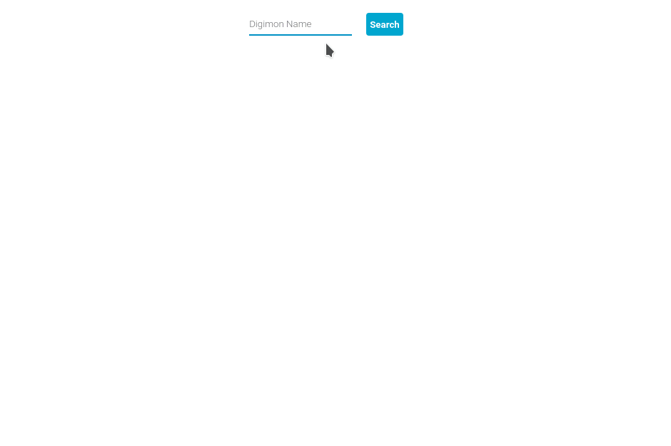

<h1 align=center>📖️ Digimon Cyber Sleuth Guide App</h1>
<p align=center>This app was created with the intention of learning in <a href="https://nextjs.org/">Next.js</a>, <a href="https://styled-components.com/">styled-components</a>, responsive, <a href="https://www.typescriptlang.org/">typescript</a> with react<p>

<h1 align=center>🎨 Client</h1>
<p align=center>Building with <a href="https://nextjs.org/">Next.js</a>, <a href="https://styled-components.com/">styled-components</a>,<a href="https://www.typescriptlang.org/">typescript</a></p>
<h4 align=center>Desktop Preview</h4>
<h4 align=center>

</h4>
<br />
<h4 align=center>Responsive Preview
</h4>
<h4 align=center>

</h4>
<br /><br />
<h1 align=center>🛠 Server</h1>
<p align=center>Building with <a href="https://nodejs.org">Node.js</a>,<a href="https://www.typescriptlang.org/">typescript</a>, <a href="https://expressjs.com/">Express.js</a>, <a href="https://www.apollographql.com/docs/apollo-server/">Apollo server</a>
</p>
For development, run dev script in folder

```bash
# YARN
yarn dev

# NPM
npm dev
```
<h2 align=center>REST Api</h2>
After start, you can access <a href="http://localhost:3001/digimons">http://localhost:3001/digimons</a> to get all informations of digimons.<br />
You have your availability several parameters like
<h4>Query Params</h4>

```http
http://localhost:3001/digimons?id=
http://localhost:3001/digimons?name=
http://localhost:3001/digimons?type=
http://localhost:3001/digimons?memory=
http://localhost:3001/digimons?attribute=
http://localhost:3001/digimons?equipSlot=
```
You can combine, example:

```http
http://localhost:3001/digimons?attribute=fire&type=virus
```

<h2 align=center>Graphql</h2>
After start, you can acess <a href="http://localhost:4000">http://localhost:4000</a> and consult
<h4>Schema</h4>

```graphql
type Digimon{
    id: String
    name: String
    type: String
    memory: String
    requirements: String
    attribute: String
    equipSlot: String
    supSkillName: String
    supSkillDescribe: String
    digivolveFrom: [String]
    digivolveInto: [String]
    skills: [Skill]
}

type Skill{
    level: String
    name: String
    sp: String
    type: String
    power: String
    attribute: String
    inherit: String
    description: String
}

input InputDigimon{
    id: String = "all"
    name: String = "all"
    type: String = "all"
    memory: String = "all"
    attribute: String = "all"
    equipSlot: String = "all"
}

type Query{
    digimon(digimon: InputDigimon): [Digimon]
}
```
